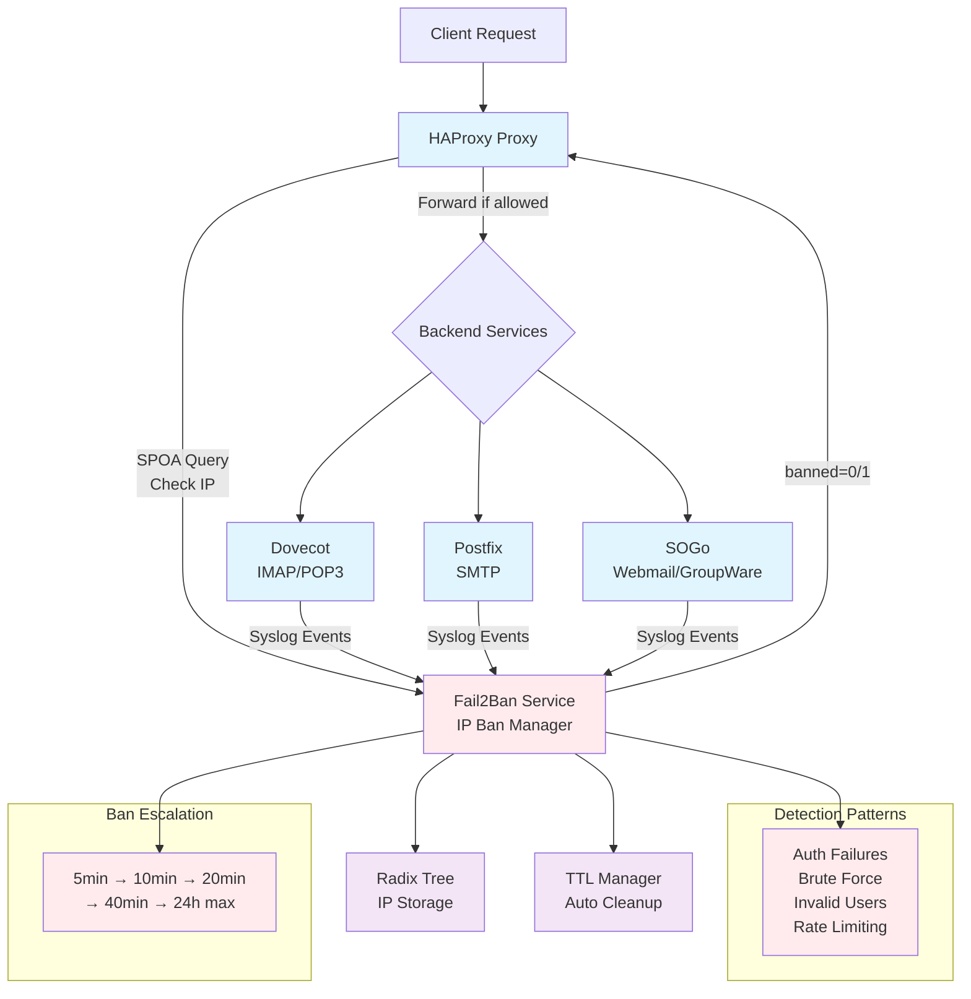

# Fail2Ban HAProxy - Real-time IP banning system

This project implements a fail2ban equivalent system for HAProxy, analyzing logs
received via syslog protocol (udp/tcp) from applications like Dovecot, Postfix and SOGo or others
in real-time and automatically banning suspicious IPs at HaProxy level via SPOA (Stream Processing Offload Agent).

## Features

- **Real-time analysis** of syslog logs (Dovecot, Postfix, SOGo, etc...)
- **Radix tree algorithm** optimized for IP storage
- **Ban escalation** with increasing ban duration
- **SPOA interface** for HAProxy
- **Flexible configuration** via YAML files
- **Structured logs** with Zap
- **TTL management** and automatic cleanup
- **Containerized architecture**

## Architecture



The idea is to proxy a service such as IMAP (dovecot), SMTP (postfix),
Web (webmail sogo) with haproxy and refuse access to IPs that would have generated repeated errors.

## Protected Services

### Dovecot (IMAP/POP3)
- IMAP/POP3 authentication failures
- Brute force attempts
- Non-existent users
- Suspicious disconnections

### Postfix (SMTP)
- SASL authentication failures
- Repeated authentication attempts
- Rate limit exceeded
- Unauthorized relay rejections
- Invalid HELO commands

### SOGo (Webmail/Groupware)
- Web connection failures
- Failed CalDAV/CardDAV authentication
- ActiveSync brute force
- Multiple expired sessions

## Configuration

### Detection patterns (config.yaml)

#### Example patterns
```yaml
    - name: "custom_service_failure"
      regex: "myservice.*failed login.*from ([0-9.]+)"
      ip_group: 1
      severity: 4
      description: "Custom service authentication failure"
```

### Ban parameters

```yaml
ban:
  initial_ban_time: "5m"      # Initial ban
  max_ban_time: "24h"         # Maximum ban
  escalation_factor: 2.0      # Escalation factor
  max_attempts: 5             # Attempts before ban
  time_window: "10m"          # Time window
  cleanup_interval: "1m"      # IP cache cleanup interval in memory
  max_memory_ttl: "72h"       # Maximum storage of an IP in memory cache
```

## Deployment

```bash
# Build and start
docker-compose up -d

# Real-time logs
docker-compose logs -f fail2ban-haproxy

# Check active bans
docker-compose exec fail2ban-haproxy tail -f /var/log/fail2ban-haproxy/app.log

# Clean shutdown
docker-compose down
```

## SPOA API

The service exposes a SPOA interface (by default on port 12345) for HAProxy:

- **Input**: Client source IP
- **Output**: `banned=1` if IP is banned, `banned=0` otherwise

## Advanced Detection Patterns

### Severity Levels
- **1-2**: Light attempts (non-existent user, expired session)
- **3-4**: Failed authentication attempts
- **5-6**: Brute force and repeated abuse

### Automatic Escalation
1. **First ban**: 5 minutes
2. **Second ban**: 10 minutes
3. **Third ban**: 20 minutes
4. **Fourth ban**: 40 minutes
5. **Maximum**: 24 hours

### Memory Management
- **Automatic cleanup**: every minute
- **Maximum TTL**: 72 hours in memory
- **Ban expiration**: automatic according to duration

## Monitoring and Observability

### Structured Logs
Logs include:
- Pattern violation detections
- IP bans with durations
- Ban expirations
- Cleanup statistics
- Performance metrics

### Available Metrics (prometheus exporter)
- Number of active banned IPs
- Violations per service
- False positive rate
- Radix tree performance

## Security

- **Strict IP validation** (IPv4/IPv6)
- **Memory limits** with automatic TTL
- **Graceful shutdown** of services
- **Network error handling** and timeouts
- **Complete containerized isolation**
- **Complete audit logs**

## Troubleshooting

### Check patterns
```bash
# Test a specific pattern
docker-compose exec fail2ban-haproxy grep "dovecot_auth_failure" /var/log/fail2ban-haproxy/app.log
```

### Debug SPOA connections
```bash
# HAProxy SPOA logs
docker-compose logs haproxy | grep spoe
```

### Real-time statistics
```bash
# HAProxy stats interface
curl http://localhost:8404/stats
```

## Configuration Files

- `config.yaml` - Example main configuration
- `haproxy.cfg` - Example HAProxy + SPOA configuration
- `spoe-ip-reputation.conf` - Example SPOE configuration
- `docker-compose.yml` - Complete test orchestration
- `postfix/main.cf` - Example Postfix configuration
- `sogo/sogo.conf` - Example SOGo configuration

