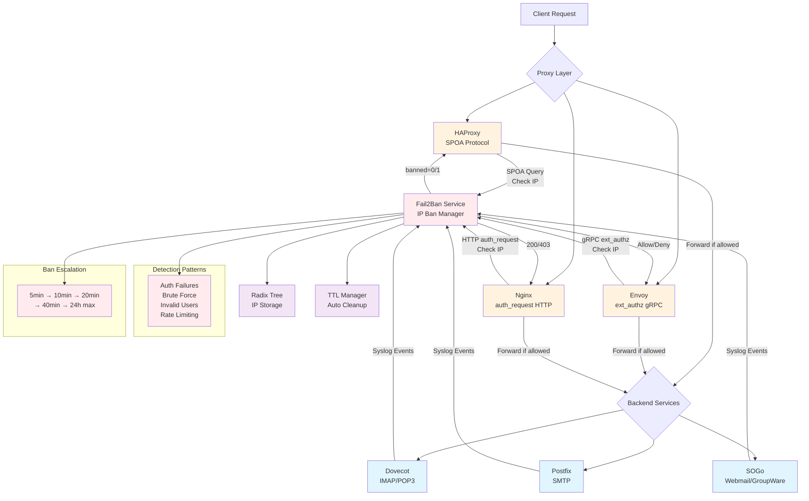

# Fail2Ban Multi-Proxy - Real-time IP banning system

This project implements a fail2ban equivalent system for HAProxy, Envoy, and Nginx, analyzing logs
received via syslog protocol (udp/tcp) from applications like Dovecot, Postfix and SOGo or others
in real-time and automatically banning suspicious IPs via multiple proxy integration methods:
- SPOA (Stream Processing Offload Agent) for HAProxy
- ext_authz gRPC service for Envoy
- auth_request HTTP module for Nginx

## Features

- **Real-time analysis** of syslog logs (Dovecot, Postfix, SOGo, etc...)
- **Radix tree algorithm** optimized for IP storage
- **Ban escalation** with increasing ban duration
- **SPOA interface** for HAProxy
- **gRPC ext_authz** for Envoy proxy
- **HTTP auth_request** for Nginx
- **Flexible configuration** via YAML files
- **Structured logs** with Zap
- **TTL management** and automatic cleanup
- **Containerized architecture**

## Architecture



The idea is to proxy a service such as IMAP (dovecot), SMTP (postfix),
Web (webmail sogo) with HAProxy, Envoy, or Nginx and refuse access to IPs that would have generated repeated errors.

All three proxy integrations are supported:
- **HAProxy**: Uses [SPOA (Stream Processing Offload Agent)](https://www.haproxy.org/download/1.8/doc/SPOE.txt) protocol
- **Envoy**: Uses [gRPC ext_authz (External Authorization)](https://www.envoyproxy.io/docs/envoy/latest/configuration/http/http_filters/ext_authz_filter) service
- **Nginx**: Uses [auth_request HTTP module](https://nginx.org/en/docs/http/ngx_http_auth_request_module.html)

## Protected Services

### Dovecot (IMAP/POP3)
- IMAP/POP3 authentication failures
- Brute force attempts
- Non-existent users
- Suspicious disconnections

### Postfix (SMTP)
- SASL authentication failures
- Repeated authentication attempts
- Rate limit exceeded
- Unauthorized relay rejections
- Invalid HELO commands

### SOGo (Webmail/Groupware)
- Web connection failures
- Failed CalDAV/CardDAV authentication
- ActiveSync brute force
- Multiple expired sessions

## Configuration

### Detection patterns (config.yaml)

#### Example patterns
```yaml
    - name: "custom_service_failure"
      regex: "myservice.*failed login.*from ([0-9.]+)"
      ip_group: 1
      severity: 4
      description: "Custom service authentication failure"
```

### Ban parameters

```yaml
ban:
  initial_ban_time: "5m"      # Initial ban
  max_ban_time: "24h"         # Maximum ban
  escalation_factor: 2.0      # Escalation factor
  max_attempts: 5             # Attempts before ban
  time_window: "10m"          # Time window
  cleanup_interval: "1m"      # IP cache cleanup interval in memory
  max_memory_ttl: "72h"       # Maximum storage of an IP in memory cache
```

## Deployment

```bash
# Build and start
docker-compose up -d

# Real-time logs
docker-compose logs -f fail2ban-haproxy

# Check active bans
docker-compose exec fail2ban-haproxy tail -f /var/log/fail2ban-haproxy/app.log

# Clean shutdown
docker-compose down
```

## SPOA API

The service exposes a SPOA interface (by default on port 12345) for HAProxy:

**Protocol Specification**: [HAProxy SPOE Documentation](https://www.haproxy.org/download/1.8/doc/SPOE.txt)

- **Input**: Client source IP
- **Output**: `banned=1` if IP is banned, `banned=0` otherwise

### Configuration Parameters

```yaml
spoa:
  address: "0.0.0.0"      # Listen address
  port: 12345             # SPOA port
  max_clients: 100        # Maximum concurrent clients
  read_timeout: "30s"     # Client read timeout
  enabled: true           # Enable/disable SPOA support
```

## Envoy ext_authz API

The service exposes a gRPC ext_authz interface (by default on port 9001) for Envoy:

**Protocol Specification**: [Envoy External Authorization Documentation](https://www.envoyproxy.io/docs/envoy/latest/configuration/http/http_filters/ext_authz_filter)

- **Protocol**: gRPC
- **Service**: Authorization service
- **Input**: Client source IP extracted from request headers and connection info
- **Output**: Allow/Deny response with custom headers

### Envoy Configuration Example

```yaml
# envoy.yaml
static_resources:
  listeners:
  - name: listener_0
    address:
      socket_address:
        address: 0.0.0.0
        port_value: 8080
    filter_chains:
    - filters:
      - name: envoy.filters.network.http_connection_manager
        typed_config:
          "@type": type.googleapis.com/envoy.extensions.filters.network.http_connection_manager.v3.HttpConnectionManager
          stat_prefix: ingress_http
          route_config:
            name: local_route
            virtual_hosts:
            - name: local_service
              domains: ["*"]
              routes:
              - match:
                  prefix: "/"
                route:
                  cluster: service_cluster
          http_filters:
          - name: envoy.filters.http.ext_authz
            typed_config:
              "@type": type.googleapis.com/envoy.extensions.filters.http.ext_authz.v3.ExtAuthz
              grpc_service:
                envoy_grpc:
                  cluster_name: fail2ban_authz
                timeout: 0.25s
              include_peer_certificate: true
          - name: envoy.filters.http.router
            typed_config:
              "@type": type.googleapis.com/envoy.extensions.filters.http.router.v3.Router

  clusters:
  - name: service_cluster
    connect_timeout: 0.25s
    type: LOGICAL_DNS
    lb_policy: ROUND_ROBIN
    load_assignment:
      cluster_name: service_cluster
      endpoints:
      - lb_endpoints:
        - endpoint:
            address:
              socket_address:
                address: backend_service
                port_value: 80

  - name: fail2ban_authz
    connect_timeout: 0.25s
    type: LOGICAL_DNS
    lb_policy: ROUND_ROBIN
    http2_protocol_options: {}
    load_assignment:
      cluster_name: fail2ban_authz
      endpoints:
      - lb_endpoints:
        - endpoint:
            address:
              socket_address:
                address: fail2ban-service
                port_value: 9001
```

### Configuration Parameters

```yaml
envoy:
  address: "0.0.0.0"    # Listen address
  port: 9001            # gRPC port
  enabled: true         # Enable/disable Envoy support
```

## Nginx auth_request API

The service exposes an HTTP auth_request interface (by default on port 8888) for Nginx:

**Protocol Specification**: [Nginx auth_request Module Documentation](https://nginx.org/en/docs/http/ngx_http_auth_request_module.html)

- **Protocol**: HTTP/HTTPS
- **Endpoint**: `/auth`
- **Method**: Any (GET, POST, etc.)
- **Input**: Client source IP extracted from headers and connection info
- **Output**: HTTP 200 (Allow) or HTTP 403 (Deny) with custom headers

### Nginx Configuration Example

```nginx
# nginx.conf
http {
    # Upstream for the auth service
    upstream fail2ban_auth {
        server fail2ban-service:8888;
    }

    # Upstream for backend services
    upstream backend_service {
        server dovecot:143;  # or postfix:25, sogo:80, etc.
    }

    server {
        listen 80;
        server_name example.com;

        # Internal auth location
        location = /auth {
            internal;
            proxy_pass http://fail2ban_auth/auth;
            proxy_pass_request_body off;
            proxy_set_header Content-Length "";
            proxy_set_header X-Original-URI $request_uri;
            proxy_set_header X-Original-IP $remote_addr;
            proxy_set_header X-Real-IP $remote_addr;
            proxy_set_header X-Forwarded-For $proxy_add_x_forwarded_for;
            proxy_set_header X-Forwarded-Proto $scheme;
            proxy_set_header Host $http_host;
        }

        # Protected location
        location / {
            # Perform auth_request
            auth_request /auth;

            # Pass auth headers to backend
            auth_request_set $fail2ban_status $upstream_http_x_fail2ban_status;
            auth_request_set $fail2ban_ip $upstream_http_x_fail2ban_ip;

            # Add headers for backend
            proxy_set_header X-Fail2ban-Status $fail2ban_status;
            proxy_set_header X-Fail2ban-IP $fail2ban_ip;
            proxy_set_header X-Real-IP $remote_addr;
            proxy_set_header X-Forwarded-For $proxy_add_x_forwarded_for;

            # Proxy to backend
            proxy_pass http://backend_service;
        }

        # Custom error page for banned IPs
        error_page 403 = @banned;
        location @banned {
            return 403 '{"error":"access_denied","reason":"IP banned due to suspicious activity"}';
            add_header Content-Type application/json;
        }
    }
}

# Stream module example for TCP proxying (IMAP, SMTP, etc.)
stream {
    # Map for auth decisions
    map $ssl_preread_server_name $auth_backend {
        default fail2ban_auth;
    }

    upstream fail2ban_auth {
        server fail2ban-service:8888;
    }

    upstream imap_backend {
        server dovecot:143;
    }

    server {
        listen 143;
        proxy_pass imap_backend;

        # For TCP streams, you'd need to implement custom logic
        # or use nginx-lua-module for auth_request equivalent
        proxy_timeout 1s;
        proxy_responses 1;
    }
}
```

### Health Check Endpoint

The service also provides a health check endpoint:

```bash
# Check service health
curl http://fail2ban-service:8888/health
# Response: {"status":"healthy","service":"fail2ban-nginx-auth"}
```

### Configuration Parameters

```yaml
nginx:
  address: "0.0.0.0"      # Listen address
  port: 8888              # HTTP port
  enabled: true           # Enable/disable Nginx support
  read_timeout: "10s"     # Request read timeout
  write_timeout: "10s"    # Response write timeout
  return_json: false      # Return JSON error responses
```

## Advanced Detection Patterns

### Severity Levels
- **1-2**: Light attempts (non-existent user, expired session)
- **3-4**: Failed authentication attempts
- **5-6**: Brute force and repeated abuse

### Automatic Escalation
1. **First ban**: 5 minutes
2. **Second ban**: 10 minutes
3. **Third ban**: 20 minutes
4. **Fourth ban**: 40 minutes
5. **Maximum**: 24 hours

### Memory Management
- **Automatic cleanup**: every minute
- **Maximum TTL**: 72 hours in memory
- **Ban expiration**: automatic according to duration

## Monitoring and Observability

### Structured Logs
Logs include:
- Pattern violation detections
- IP bans with durations
- Ban expirations
- Cleanup statistics
- Performance metrics

### Available Metrics (prometheus exporter)
- Number of active banned IPs
- Violations per service
- False positive rate
- Radix tree performance

## Security

- **Strict IP validation** (IPv4/IPv6)
- **Memory limits** with automatic TTL
- **Graceful shutdown** of services
- **Network error handling** and timeouts
- **Complete containerized isolation**
- **Complete audit logs**

## Troubleshooting

### Check patterns
```bash
# Test a specific pattern
docker-compose exec fail2ban-haproxy grep "dovecot_auth_failure" /var/log/fail2ban-haproxy/app.log
```

### Debug SPOA connections
```bash
# HAProxy SPOA logs
docker-compose logs haproxy | grep spoe
```

### Debug Envoy ext_authz connections
```bash
# Envoy access logs with authorization decisions
docker-compose logs envoy | grep ext_authz

# Check fail2ban service gRPC logs
docker-compose logs fail2ban-haproxy | grep "ext_authz\|grpc"
```

### Debug Nginx auth_request connections
```bash
# Nginx access logs with auth_request status
docker-compose logs nginx | grep auth_request

# Test auth endpoint directly
curl -H "X-Real-IP: 192.168.1.100" http://fail2ban-service:8888/auth
# Response: 200 (allowed) or 403 (banned)

# Check fail2ban service HTTP logs
docker-compose logs fail2ban-haproxy | grep "auth_request\|nginx"

# Check health endpoint
curl http://fail2ban-service:8888/health
```

### Real-time statistics
```bash
# HAProxy stats interface
curl http://localhost:8404/stats
```

## Protocol Specifications

This service implements the following proxy authorization protocols:

### HAProxy SPOA (Stream Processing Offload Agent)
- **Official Documentation**: [HAProxy SPOE Specification](https://www.haproxy.org/download/1.8/doc/SPOE.txt)
- **Protocol Type**: Binary TCP protocol
- **Port**: 12345 (default)
- **Use Case**: HAProxy load balancer authorization

### Envoy ext_authz (External Authorization)
- **Official Documentation**: [Envoy ext_authz Filter](https://www.envoyproxy.io/docs/envoy/latest/configuration/http/http_filters/ext_authz_filter)
- **Protocol Specification**: [gRPC Authorization Service](https://github.com/envoyproxy/envoy/blob/main/api/envoy/service/auth/v3/external_auth.proto)
- **Protocol Type**: gRPC over HTTP/2
- **Port**: 9001 (default)
- **Use Case**: Envoy proxy service mesh authorization

### Nginx auth_request
- **Official Documentation**: [Nginx auth_request Module](https://nginx.org/en/docs/http/ngx_http_auth_request_module.html)
- **Protocol Type**: HTTP/1.1 subrequest
- **Port**: 8888 (default)
- **Use Case**: Nginx web server authorization

## Complete Configuration Example

You can enable/disable any combination of the three proxy integrations:

```yaml
# Complete configuration with all services
spoa:
  address: "0.0.0.0"
  port: 12345
  enabled: true          # Enable for HAProxy integration

envoy:
  address: "0.0.0.0"
  port: 9001
  enabled: true          # Enable for Envoy integration

nginx:
  address: "0.0.0.0"
  port: 8888
  enabled: true          # Enable for Nginx integration

# Example: Only Nginx and Envoy enabled
# spoa:
#   enabled: false       # Disable HAProxy SPOA
# envoy:
#   enabled: true        # Enable Envoy ext_authz
# nginx:
#   enabled: true        # Enable Nginx auth_request
```

## Project Structure

```
├── internal/               # Go source code
│   ├── config/            # Configuration management
│   ├── envoy/             # Envoy ext_authz server
│   ├── ipban/             # IP banning logic
│   ├── nginx/             # Nginx auth_request server
│   └── syslog/            # Syslog reader
├── tests-ressources/      # Docker Compose test environment
│   ├── config.yaml        # Test configuration
│   ├── config-example.yaml # Example configuration
│   ├── haproxy.cfg         # HAProxy + SPOA config
│   ├── envoy-example.yaml  # Envoy + ext_authz config
│   ├── nginx-example.conf  # Nginx + auth_request config
│   ├── postfix/           # Postfix configurations
│   ├── sogo/              # SOGo configurations
│   └── README.md          # Test environment documentation
├── docker-compose.yml     # Complete test orchestration
├── Dockerfile             # Service container build
└── main.go               # Application entry point
```

## Configuration Files

- `tests-ressources/config-example.yaml` - Example main configuration with SPOA, Envoy, and Nginx
- `tests-ressources/haproxy.cfg` - Example HAProxy + SPOA configuration
- `tests-ressources/spoe-ip-reputation.conf` - Example SPOE configuration
- `tests-ressources/envoy-example.yaml` - Example Envoy + ext_authz configuration
- `tests-ressources/nginx-example.conf` - Example Nginx + auth_request configuration
- `docker-compose.yml` - Complete test orchestration
- `tests-ressources/postfix/main.cf` - Example Postfix configuration
- `tests-ressources/sogo/sogo.conf` - Example SOGo configuration

