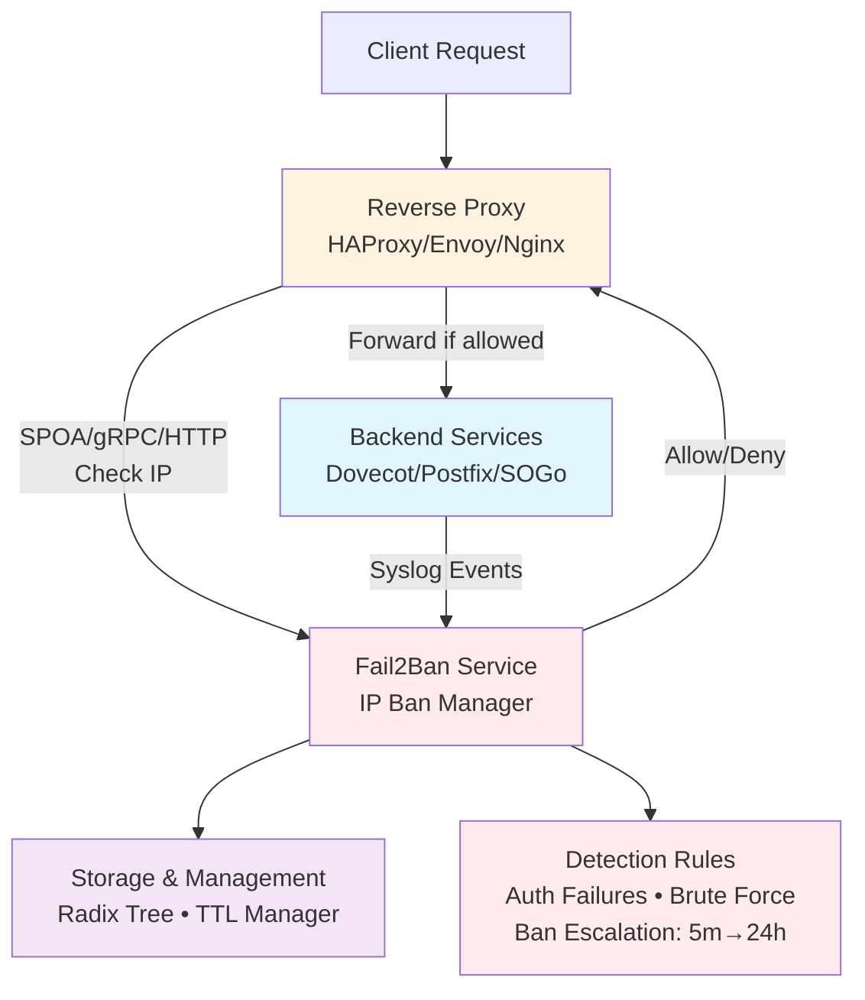
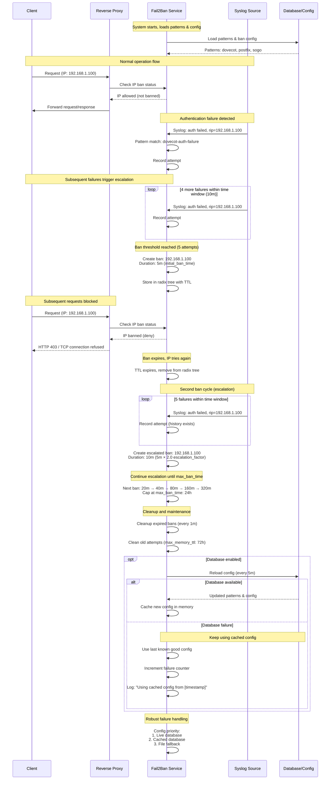

# Fail2Ban Multi-Proxy - Documentation

Real-time IP banning system for HAProxy, Envoy, and Nginx. Originally designed to protect Dovecot, Postfix, and SOGo by analyzing syslog logs, but can protect any service behind supported reverse proxies.

## Documentation Index

- **[Installation](installation.md)** - Installation methods and setup
- **[Configuration](configuration.md)** - Complete configuration reference
- **[Proxy Integration](proxy-integration.md)** - Overview of proxy integration methods
  - **[HAProxy Integration](haproxy.md)** - Detailed HAProxy SPOA configuration
  - **[Envoy Integration](envoy.md)** - Detailed Envoy ext_authz configuration
  - **[Nginx Integration](nginx.md)** - Detailed Nginx auth_request configuration
- **[Testing](testing.md)** - Unit tests, integration tests, and performance testing
- **[Troubleshooting](troubleshooting.md)** - Common issues and debugging guide

## Architecture



## Ban Escalation Mechanics



## Key Features

- **Real-time syslog analysis** with regex pattern matching
- **Multiple proxy support**: HAProxy (SPOA), Envoy (gRPC ext_authz), Nginx (auth_request)
- **Ban escalation**: Configurable timeouts from 5 minutes to 24 hours
- **Radix tree storage**: Optimized IP address management
- **Database integration**: SQL-based configuration with hot reloading
- **Robust failure handling**: Configuration caching and automatic fallback
- **Prometheus metrics**: Comprehensive monitoring and observability
- **Environment variables**: Full configuration override support

## Quick Start

```bash
# Basic deployment
docker-compose up -d

# Check service health
curl http://localhost:8888/health

# Test auth endpoint
curl -H "X-Real-IP: 192.168.1.100" http://localhost:8888/auth
```

## Supported Services

Originally designed for:
- **Dovecot** (IMAP/POP3): Authentication failures, brute force
- **Postfix** (SMTP): SASL failures, relay attempts
- **SOGo** (Webmail): Login failures, CalDAV/CardDAV abuse

Can protect **any service** that can be reverse proxied behind HAProxy, Envoy, or Nginx.

## Configuration Overview

```yaml
# Enable all proxy integrations
spoa:
  port: 12345
  enabled: true     # HAProxy

envoy:
  port: 9001
  enabled: true     # Envoy

nginx:
  port: 8888
  enabled: true     # Nginx

# Ban configuration
ban:
  initial_ban_time: "5m"
  max_ban_time: "24h"
  max_attempts: 5
  time_window: "10m"

# Database configuration (optional)
database:
  enabled: true
  driver: "sqlite3"
  dsn: "./fail2ban.db"
  refresh_interval: "5m"

# Prometheus metrics (optional)
prometheus:
  enabled: true
  port: 2112
  path: "/metrics"
```

## Project Structure

```
├── docs/                   # Documentation
├── internal/               # Go source code
│   ├── config/            # Configuration management & hot reloading
│   ├── database/          # SQL database integration
│   ├── metrics/           # Prometheus metrics collection
│   ├── envoy/             # Envoy ext_authz server
│   ├── ipban/             # IP banning logic
│   ├── nginx/             # Nginx auth_request server
│   └── syslog/            # Syslog reader
├── tests-ressources/      # Docker Compose test environment
├── .github/workflows/     # CI/CD pipelines
├── docker-compose.yml     # Complete test orchestration
├── Dockerfile             # Service container build
└── main.go               # Application entry point
```