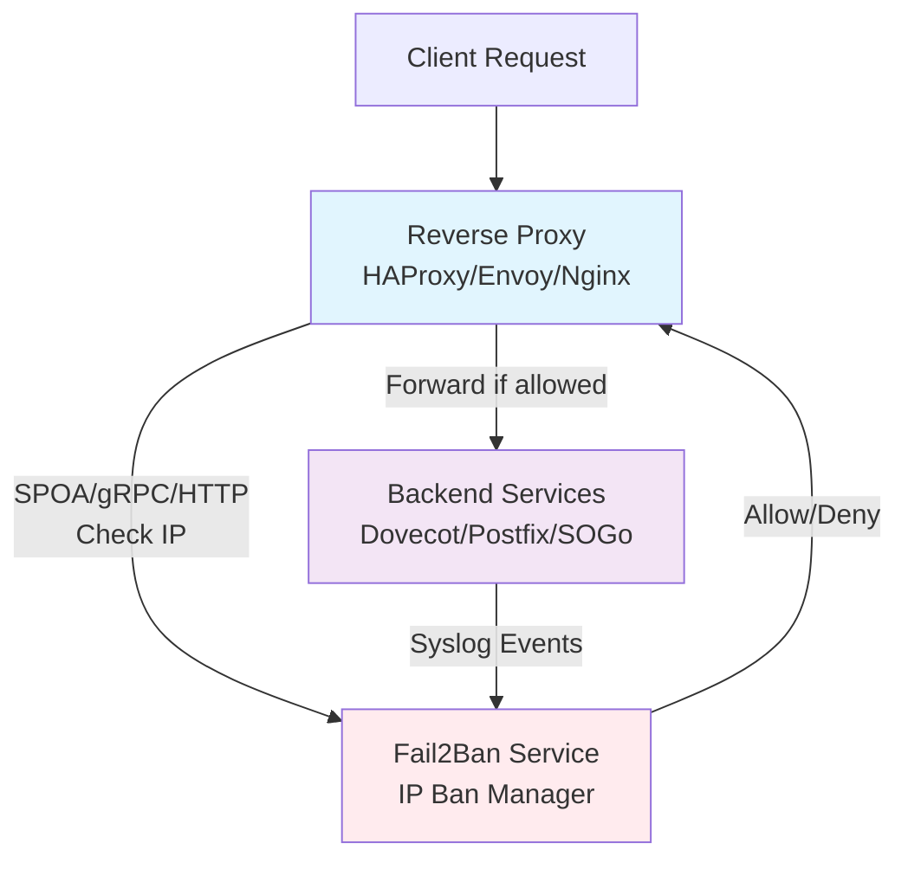

# Proxy Integration Overview

This document provides an overview of how to integrate Fail2Ban Multi-Proxy with different reverse proxy technologies. Each proxy type has its own dedicated documentation page with detailed configuration examples.

## Supported Proxy Technologies

The Fail2Ban Multi-Proxy service supports three different proxy integration methods:

### 🔹 HAProxy - SPOA Protocol
- **Protocol**: SPOA (Stream Processing Offload Agent)
- **Port**: 12345 (default)
- **Type**: Binary TCP protocol
- **Use Case**: HAProxy load balancer authorization
- **Documentation**: [HAProxy Integration Guide](haproxy.html)

### 🔹 Envoy - gRPC ext_authz
- **Protocol**: gRPC over HTTP/2
- **Port**: 9001 (default)
- **Type**: External Authorization service
- **Use Case**: Envoy proxy service mesh authorization
- **Documentation**: [Envoy Integration Guide](envoy.html)

### 🔹 Nginx - auth_request Module
- **Protocol**: HTTP/HTTPS
- **Port**: 8888 (default)
- **Type**: HTTP subrequest
- **Use Case**: Nginx web server authorization
- **Documentation**: [Nginx Integration Guide](nginx.html)

## Quick Configuration Overview

### Enable All Proxies

```yaml
# config.yaml - Enable all three proxy integrations
spoa:
  address: "0.0.0.0"
  port: 12345
  enabled: true          # HAProxy SPOA

envoy:
  address: "0.0.0.0"
  port: 9001
  enabled: true          # Envoy ext_authz

nginx:
  address: "0.0.0.0"
  port: 8888
  enabled: true          # Nginx auth_request
```

### Selective Integration

You can enable only the proxy types you need:

```yaml
# Example: Only Nginx and Envoy
spoa:
  enabled: false         # Disable HAProxy SPOA

envoy:
  enabled: true          # Enable Envoy ext_authz

nginx:
  enabled: true          # Enable Nginx auth_request
```

## Architecture Diagram



## Integration Comparison

| Feature | HAProxy SPOA | Envoy ext_authz | Nginx auth_request |
|---------|--------------|-----------------|-------------------|
| **Protocol** | Binary TCP | gRPC/HTTP2 | HTTP/1.1 |
| **Performance** | Very High | High | Medium |
| **Configuration Complexity** | Low | Medium | HTTP: Medium, Mail: Medium, TCP: High |
| **TCP Proxying with External Auth** | Full support | Full support | Mail: ngx_mail, TCP: Lua* |
| **Auth Response Caching** | Manual setup | Built-in features | Built-in features |
| **Load Balancing** | Built-in | Built-in | Built-in |

**\* TCP Proxying with Nginx:** Nginx can proxy TCP traffic via the `stream` module, but `auth_request` only works for HTTP. For TCP authorization with external auth, you need Lua scripts. For mail protocols specifically (IMAP/SMTP/POP3), Nginx also provides the `ngx_mail` module with native `auth_http` support that can integrate with the Fail2Ban service.

## Common Configuration Patterns

### Docker Compose Integration

```yaml
version: '3.8'

services:
  fail2ban-service:
    image: ghcr.io/cabonemailserver/webfail2ban:latest
    ports:
      - "12345:12345"  # HAProxy SPOA
      - "9001:9001"    # Envoy gRPC
      - "8888:8888"    # Nginx HTTP
      - "514:514/udp"  # Syslog
    volumes:
      - ./config.yaml:/app/config.yaml

  # Choose your proxy technology
  haproxy:
    image: haproxy:2.8
    ports:
      - "80:80"
      - "143:143"
    volumes:
      - ./haproxy.cfg:/usr/local/etc/haproxy/haproxy.cfg

  envoy:
    image: envoyproxy/envoy:v1.28-latest
    ports:
      - "8080:8080"
    volumes:
      - ./envoy.yaml:/etc/envoy/envoy.yaml

  nginx:
    image: nginx:1.25-alpine
    ports:
      - "8081:80"
    volumes:
      - ./nginx.conf:/etc/nginx/nginx.conf
```

## Testing All Integrations

```bash
# Test HAProxy SPOA (if enabled)
telnet localhost 143

# Test Envoy ext_authz (if enabled)
curl http://localhost:8080/

# Test Nginx auth_request (if enabled)
curl http://localhost:8081/

# Test auth endpoint directly
curl -H "X-Real-IP: 192.168.1.100" http://localhost:8888/auth

# Check service health
curl http://localhost:8888/health
```

## Performance and Monitoring

### Health Checks

Each proxy integration provides monitoring capabilities:

- **HAProxy**: Statistics interface and admin socket
- **Envoy**: Admin interface with detailed metrics
- **Nginx**: Status module and access logs

### Logging

All integrations support structured logging with ban status information:

```bash
# Monitor authorization decisions
docker logs fail2ban-service -f | grep -E "(SPOA|gRPC|HTTP).*IP"

# Check proxy-specific logs
docker logs haproxy -f    # HAProxy logs
docker logs envoy -f      # Envoy access logs
docker logs nginx -f      # Nginx access logs
```

## Troubleshooting

### Common Issues Across All Proxies

1. **Service connectivity**: Ensure Fail2Ban service is running and accessible
2. **Port conflicts**: Check that configured ports are available
3. **Network policies**: Verify firewall rules allow communication
4. **Configuration syntax**: Validate proxy configuration files

### Debug Commands

```bash
# Check if services are listening
netstat -tlnp | grep -E ':(12345|9001|8888)'

# Test service connectivity
telnet fail2ban-service 12345  # SPOA
telnet fail2ban-service 9001   # Envoy (will fail - gRPC only)
curl fail2ban-service:8888/health  # Nginx

# Generate test traffic
for i in {1..6}; do
    echo "<134>$(date '+%b %d %H:%M:%S') hostname dovecot: auth failed, method=PLAIN, rip=192.168.1.100" | nc -u localhost 514
    sleep 1
done
```

## Security Considerations

- Use dedicated networks for auth service communication
- Implement proper firewall rules
- Configure appropriate timeouts and circuit breakers
- Monitor for service availability and performance
- Consider TLS encryption for production environments
- Implement proper error handling and fallback strategies

## Next Steps

Choose your proxy technology and follow the detailed integration guide:

- **[HAProxy Integration →](haproxy.html)** - For high-performance load balancing with SPOA
- **[Envoy Integration →](envoy.html)** - For modern service mesh architectures with gRPC
- **[Nginx Integration →](nginx.html)** - For web server proxying with auth_request